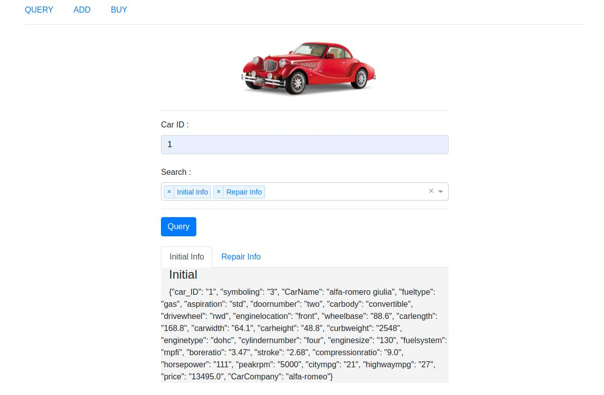
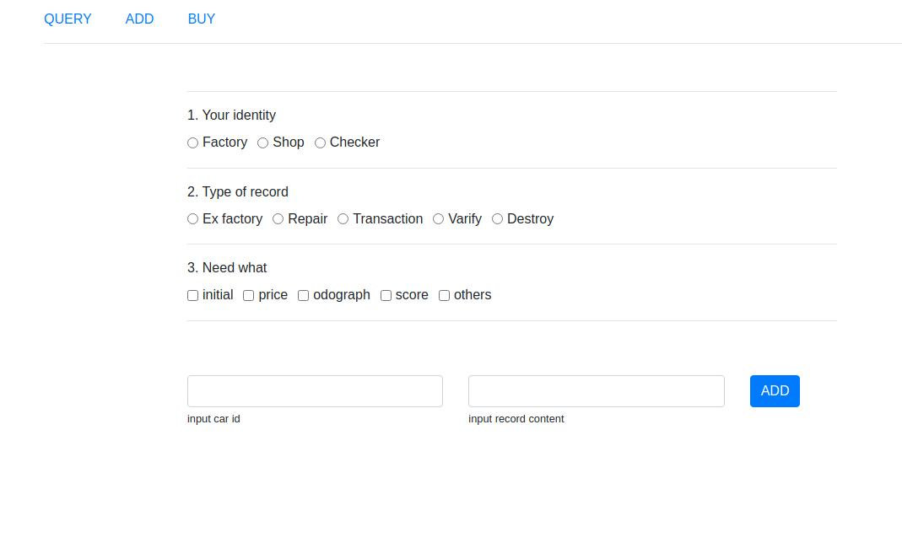
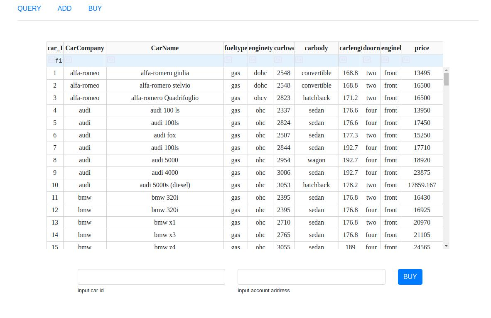

## Intro
Use Web3-python to initialize and create an unchangeable smart contract for each vehicle, retrieve the contract address according to the vehicle ID, and query the vehicle information.

## Env
- Ubuntu 20.04
- python 3.8
- [web3](https://web3py.readthedocs.io/en/stable/quickstart.html#test-provider)
- [py-solc-x](https://web3py.readthedocs.io/en/stable/contracts.html)
- requirements.txt

## Show
---

---

---
